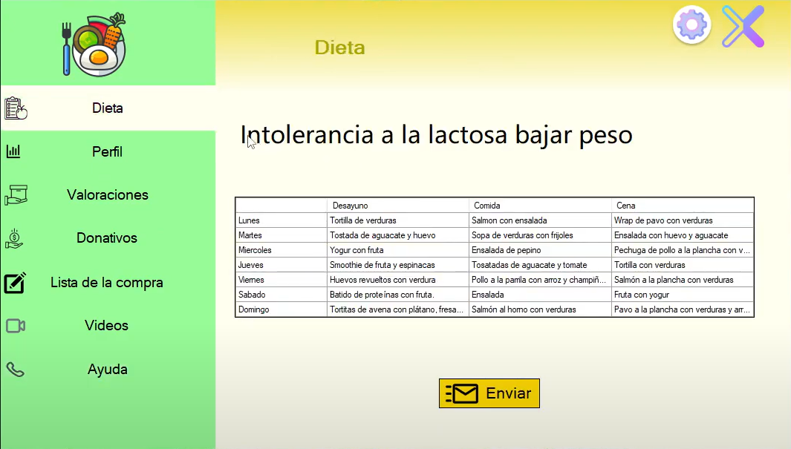
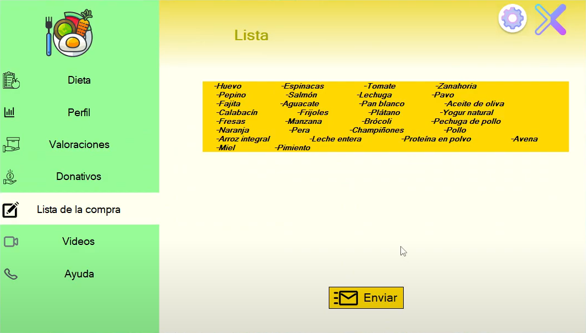

# Introduction

NutriWise is a diet application project where we apply everything learned during the first course (C#, SQL, HTML, CSS, AWS, and more). It was developed using the SCRUM methodology. We conducted a 10-day sprint to try to develop the minimum viable product, and I can say that we achieved what we wanted.

# Operation

To access the application, registration or sign-up is necessary. Once logged in, it allows obtaining a diet based on the user's goals, intolerances, and level of physical activity.

After entering all the user's data, the application provides a 'personalized' diet, as we can see in the following image:

Additionally, it allows us to send the diet to the user via email. We can view and edit user data in the 'Perfil' section, rate the application in the 'Ratings' section, make donations to the development team in the 'Donativos' section.

In the 'Lista de la compra' section, there is a shopping list with all the necessary ingredients to carry out the diet, as we can see in the following image:

We also have the option to email the shopping list to the user.

In the 'Videos' section, we can watch interesting recipe videos that, when clicked, redirect us to the YouTube video.

Finally, in the 'Ayuda' section, we find the necessary contact information to get in touch with the customer support team.

# [Demo Video](https://www.youtube.com/watch?v=yssuI-YBxUQ&ab_channel=HugoEstell%C3%A9s)

# [Code](https://github.com/hugoestelles/EquipoVerde)
