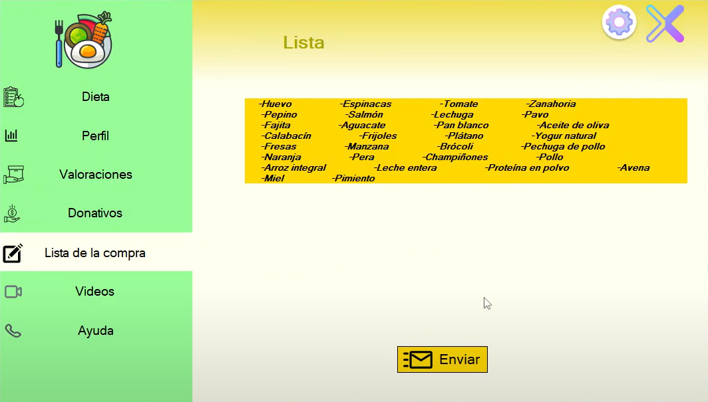

#Introduccion

NutriWise es un proyecto de aplicación de dietas donde aplicamos todo lo aprendido durante el primer curso (C#, SQL, HTML, CSS, AWS y mas).
Fue desarrollado utilizando la metodologia SCRUM, hicimos un sprint de 10 dias para intentar desarrollar el producto minimo viable y puedo decir que conseguimos lo que queriamos.

#Funcionamiento

Para entrar a la aplicacion es necesario estar registrado o registrarse, una vez entramos, permite obtener una dieta en base a los objetivos, intolerancias y nivel de actividad fisica del usuario.

Una vez introducidos todos los datos del usuario la apliación nos da una dieta 'personalizada' como podemos ver en la siguiente imagen;

Ademas, nos permite mandar la dieta al usuario por correo electronico, podemos ver y editar los datos del usuario en el apartado 'Perfil', valorar la aplicación en el apartado 'Valoraciones', realizar donativos al equipo desarrollo en el apartado 'Donativos'.

En el apartado 'Lista de la compra' aparece una lista de la compra con todos los ingredientes necesarios para llevar a cabo la dieta como podemos ver en la siguiente imagen;

Tambien tenemos la posibilidad de enviarle por correo electronico al usuario la lista de la compra.

En el apartado 'Videos' podemos ver videos de recetas interesantes que al hacer click nos redirige al video de YouTube.

Por ultimo, en el apartado 'Ayuda' encontramos la informacion de contacto necesaria para contactar con el equipo de atención al cliente.

#Video demo [video](https://www.youtube.com/watch?v=yssuI-YBxUQ&ab_channel=HugoEstell%C3%A9s)
